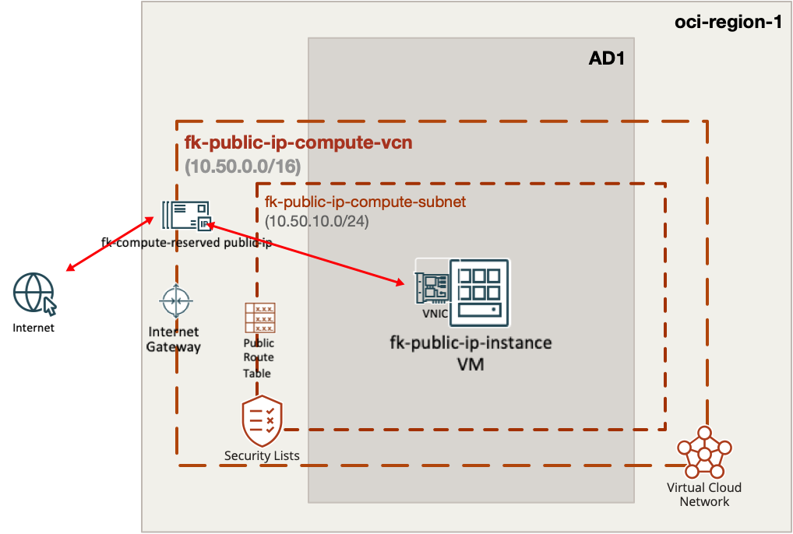
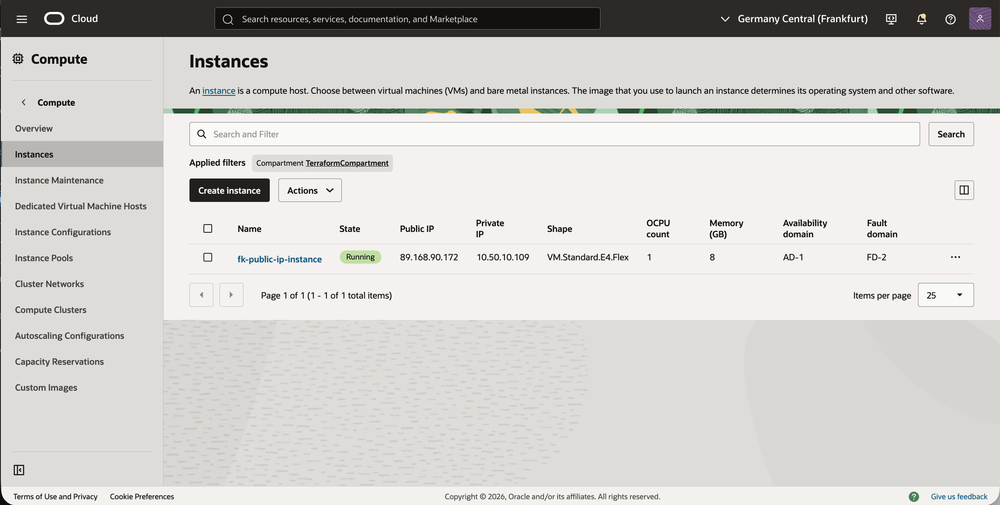
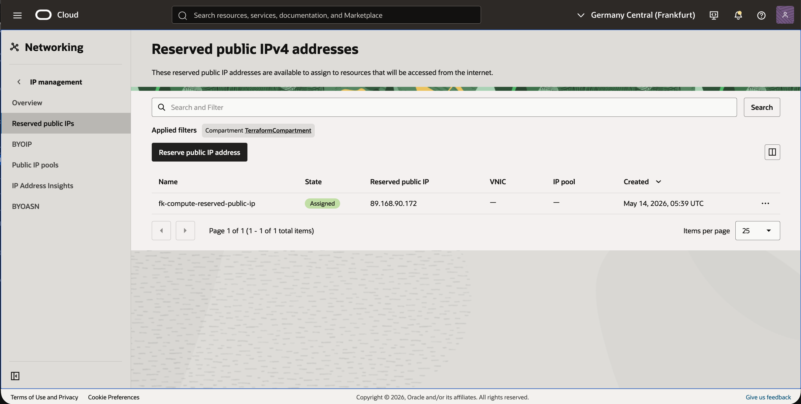
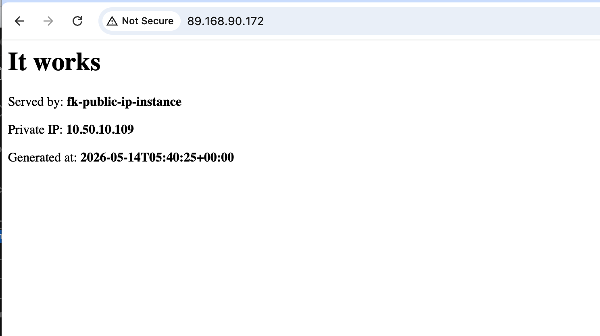

# Example 01: Reserved OCI Public IP Attached To A Compute Instance

In this example, we deploy a **single Oracle Cloud Infrastructure (OCI) compute instance**
using `terraform-oci-fk-compute` and then attach a **reserved OCI public IP**
created by `terraform-oci-fk-public-ip` to the instance primary private IP.

This setup combines:
- `terraform-oci-fk-vcn` for networking
- `terraform-oci-fk-compute` for the instance
- `terraform-oci-fk-public-ip` for the reserved public IP resource

---

## Architecture Overview



This deployment creates:
- A dedicated VCN with one **public subnet**
- One **regular OCI compute instance** launched without an automatically assigned public IP
- One **reserved OCI public IP** attached explicitly to the instance primary private IP
- A bootstrap `cloud-init` that starts a simple built-in HTTP service on port `80`

Traffic flow:
- Clients connect to the reserved public IP address
- OCI maps that public IP to the instance primary private IP
- The instance serves a simple demo page over HTTP

This example shows the explicit OCI pattern where **public reachability is modeled as a separate networking resource**
instead of being hidden inside the compute launch path.

---

## Deployment Steps

Initialize and apply the Terraform/OpenTofu configuration:

```bash
tofu init
tofu plan
tofu apply
```

If you prefer Terraform:

```bash
terraform init
terraform plan
terraform apply
```

---

## Outputs

After a successful deployment, the example returns:
- `instance_id`
- `instance_private_ip`
- `reserved_public_ip_id`
- `reserved_public_ip_address`
- `vcn_id`

These outputs let you:
- identify the created compute instance
- verify the private IP to which the reserved public IP was attached
- test HTTP access through the reserved public IP address

---

## Runtime Verification

After deployment, the instance should:
- remain attached to the expected VCN and subnet
- expose a simple HTTP page on port `80`
- be reachable through the reserved public IP created by this module

Because the public IP is attached through `private_ip_id`,
the compute module keeps responsibility for the instance lifecycle
while the public IP module owns the public frontend identity.

---

## OCI Console And Runtime Verification

### Instance Status



This view confirms that the compute instance is deployed successfully
and is using the expected primary network attachment for the public IP handoff flow.

### Reserved Public IP Details



This view confirms that the OCI public IP resource is created as `RESERVED`
and attached explicitly to the instance primary private IP.

### HTTP Access



This runtime verification confirms that:
- the reserved public IP is reachable from the internet
- traffic is mapped correctly to the compute instance
- the demo page returns hostname, private IP, and generation timestamp

---

## Notes

This example uses:
- a public subnet for simplicity
- Oracle Linux 9 for predictable bootstrap behavior
- a direct `private_ip_id` lookup using OCI data sources
- a reserved public IP instead of the compute module built-in ephemeral public IP path

The key integration point is the explicit handoff from compute to public IP:

```hcl
module "public_ip" {
  source = "git::https://github.com/foggykitchen/terraform-oci-fk-public-ip.git?ref=v1.0.0"

  name             = "fk-compute-reserved-public-ip"
  compartment_ocid = var.compartment_ocid
  private_ip_id    = data.oci_core_private_ips.instance_primary.private_ips[0].id
}
```

That keeps public addressing composable and auditable across modules.

---

## Cleanup

To remove all resources created by this example:

```bash
tofu destroy
```

Or with Terraform:

```bash
terraform destroy
```

---

## Summary

This example demonstrates:
- how to deploy a **single OCI compute instance** without an auto-assigned public IP
- how to resolve the instance primary `private_ip_id`
- how to attach a **reserved OCI public IP** using `terraform-oci-fk-public-ip`

---

## License

Licensed under the **Universal Permissive License (UPL), Version 1.0**.
See [LICENSE](../../LICENSE) for more details.

---

© 2026 [FoggyKitchen.com](https://foggykitchen.com) - Cloud. Code. Clarity.
