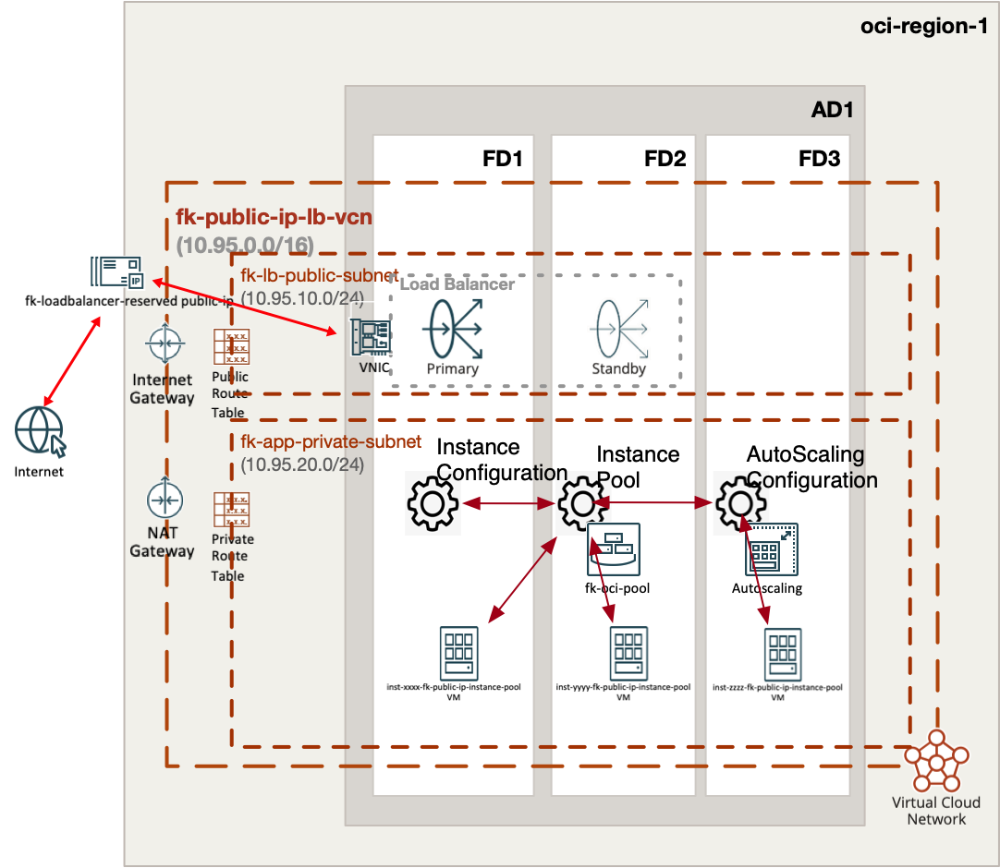
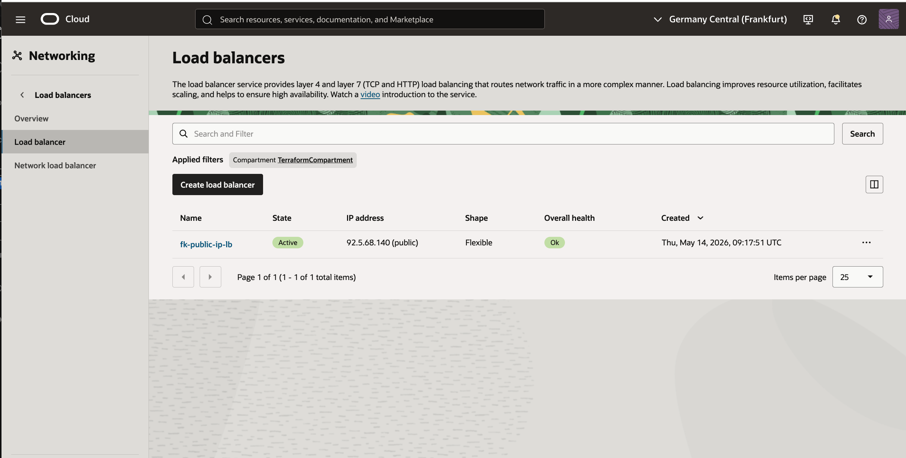
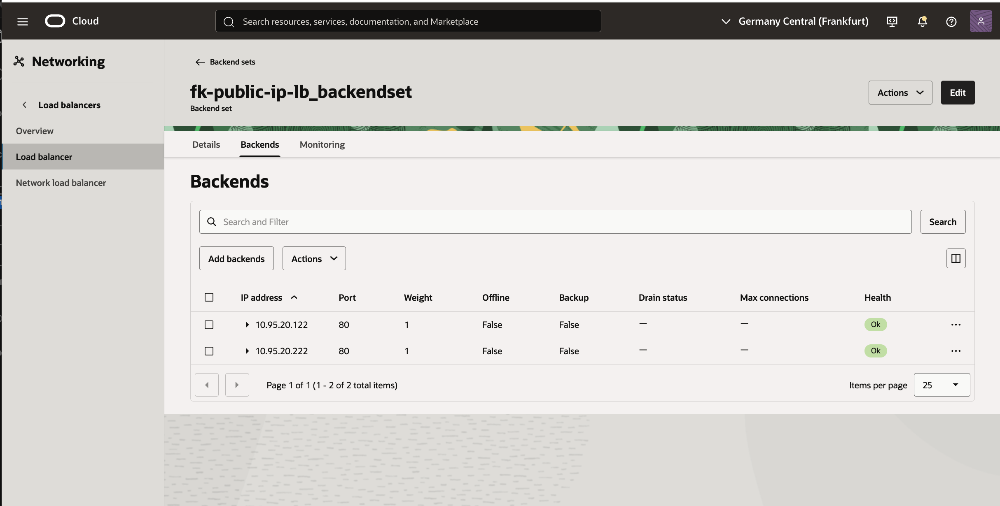
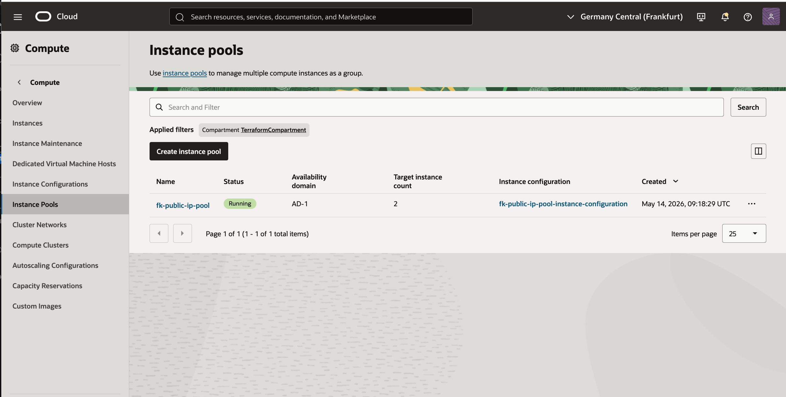
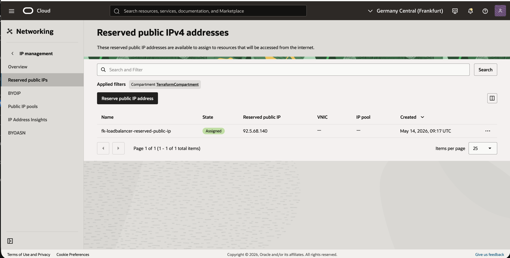
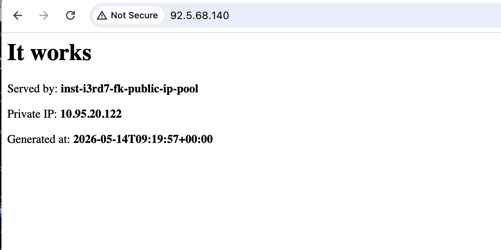

# Example 02: Reserved OCI Public IP Used By A Public Load Balancer

In this example, we deploy a **public Oracle Cloud Infrastructure (OCI) Load Balancer**
using `terraform-oci-fk-loadbalancer`, back it with an **OCI instance pool**
created by `terraform-oci-fk-compute`, and supply the load balancer frontend identity
through a **reserved OCI public IP** created by `terraform-oci-fk-public-ip`.

This setup combines:
- `terraform-oci-fk-vcn` for networking
- `terraform-oci-fk-public-ip` for the reserved public IP
- `terraform-oci-fk-loadbalancer` for the public load balancer
- `terraform-oci-fk-compute` for the backend instance pool

---

## Architecture Overview



This deployment creates:
- A dedicated VCN with one **public subnet** for the load balancer
- One **private subnet** for the application instances
- One **reserved OCI public IP** created independently from the load balancer
- One **public OCI Load Balancer** using that reserved public IP as its frontend identity
- One **instance pool** attached to the load balancer backend set
- Threshold-based autoscaling for the backend tier
- A bootstrap `cloud-init` that starts a simple built-in HTTP service on every pool instance

Traffic flow:
- Clients connect to the reserved public IP address
- The OCI Load Balancer receives traffic on port `80`
- The load balancer forwards HTTP traffic to healthy pool members on port `80`
- Backend instances remain private and are not exposed directly to the internet

This example demonstrates the clean split where **public addressing is owned by one module**
and **traffic distribution is owned by another**.

---

## Deployment Steps

Initialize and apply the Terraform/OpenTofu configuration:

```bash
tofu init
tofu plan
tofu apply
```

If you prefer Terraform:

```bash
terraform init
terraform plan
terraform apply
```

---

## Outputs

After a successful deployment, the example returns:
- `reserved_public_ip_id`
- `reserved_public_ip_address`
- `load_balancer_id`
- `load_balancer_public_ips`
- `instance_pool_id`
- `autoscaling_configuration_id`

These outputs let you:
- identify the reserved public IP resource
- confirm which address is exposed publicly
- verify that the load balancer and instance pool were created and integrated correctly

---

## Runtime Verification

After deployment, the environment should:
- expose the reserved public IP through the load balancer frontend
- forward traffic to healthy backend instances in the private subnet
- keep public IP ownership separate from the load balancer module itself

Because the load balancer service may claim the reserved IP internally,
this example enables drift tolerance on `private_ip_id` in the public IP module:

```hcl
module "public_ip" {
  source = "git::https://github.com/foggykitchen/terraform-oci-fk-public-ip.git?ref=v1.0.0"

  name                         = "fk-loadbalancer-reserved-public-ip"
  compartment_ocid             = var.compartment_ocid
  ignore_private_ip_id_changes = true
}
```

That preserves the reserved public IP as a reusable building block
without forcing the module to own the load balancer private endpoint internals.

---

## OCI Console And Runtime Verification

### Load Balancer Status



This view confirms that the public OCI Load Balancer is deployed successfully,
is active, and exposes the expected public frontend IP address.

### Backend Health



This view shows that the backend set contains healthy private backend instances
registered from the instance pool.

### Instance Pool Status



This view confirms that the OCI instance pool is running
with the expected target instance count for the backend tier.

### Reserved Public IP Details



This view confirms that the reserved public IP resource exists independently
and is assigned as the public frontend identity used by the load balancer.

### HTTP Access Through The Load Balancer



This runtime verification confirms that:
- the reserved public IP is reachable from the internet
- traffic is flowing through the public load balancer
- the request is served by a healthy backend instance from the pool

---

## Notes

This example uses:
- a public subnet for the load balancer
- a private subnet for the application instances
- Oracle Linux 9 for predictable bootstrap behavior
- instance-pool-to-load-balancer attachment via `lb_attachment`
- a reserved public IP attached to the load balancer through `reserved_public_ip_id`

The key integration point is the handoff into the load balancer module:

```hcl
module "loadbalancer" {
  source = "git::https://github.com/foggykitchen/terraform-oci-fk-loadbalancer.git?ref=v1.0.0"

  name                  = "fk-public-ip-lb"
  compartment_ocid      = var.compartment_ocid
  subnet_ids            = [module.vcn.subnet_ids["fk_lb_public_subnet"]]
  reserved_public_ip_id = module.public_ip.id
}
```

---

## Cleanup

To remove all resources created by this example:

```bash
tofu destroy
```

Or with Terraform:

```bash
terraform destroy
```

---

## Summary

This example demonstrates:
- how to create a **reserved OCI public IP** independently
- how to expose that IP through a **public OCI Load Balancer**
- how to combine `terraform-oci-fk-public-ip`, `terraform-oci-fk-loadbalancer`, and `terraform-oci-fk-compute`

---

## License

Licensed under the **Universal Permissive License (UPL), Version 1.0**.
See [LICENSE](../../LICENSE) for more details.
